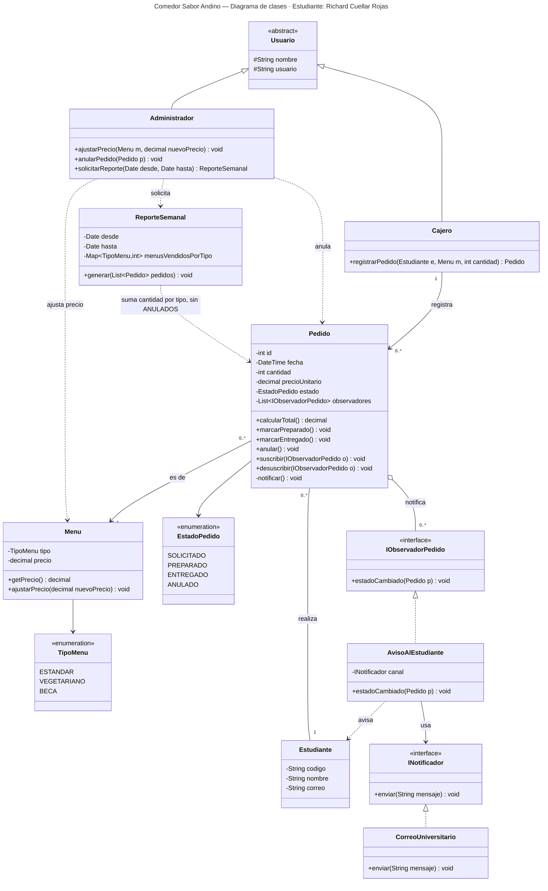
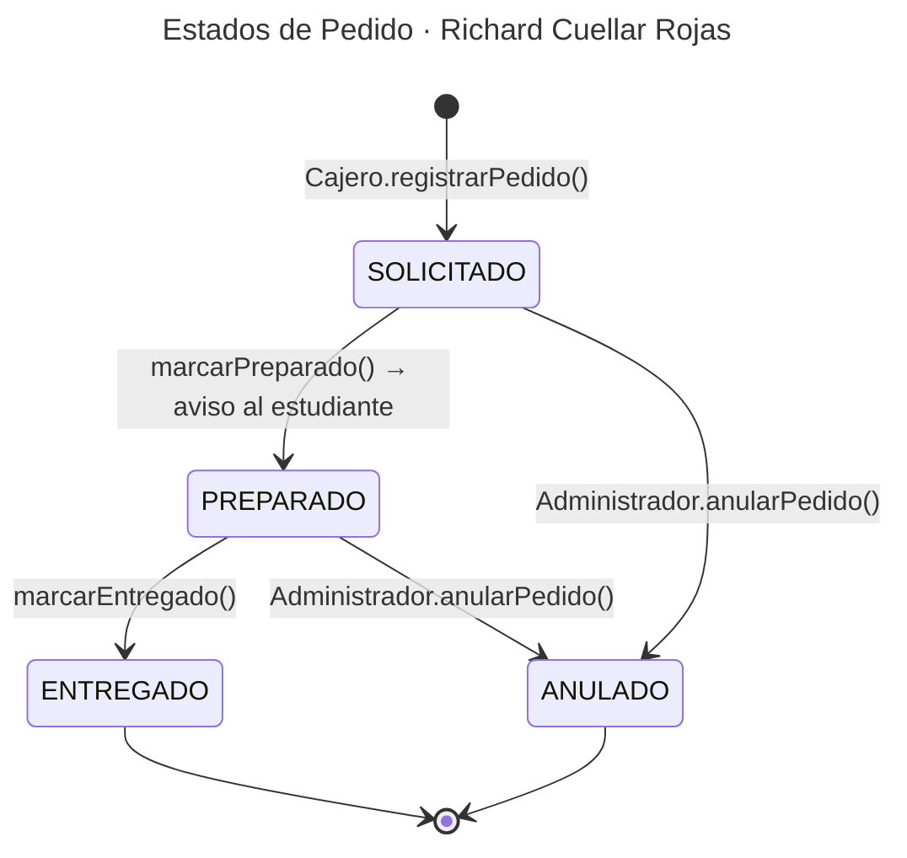

# Parte 1 — El plano: diagrama de clases del comedor "Sabor Andino"

**Estudiante:** Richard Cuellar Rojas · Arquitectura de Software
**Variante:** A — Comedor Universitario

## Paso 1 — Sustantivos (candidatos a clase o atributo)

Sustantivos: sistema, pedido, menú, estudiante, cantidad ("uno o más"), tipo, estado, comedor, rol, cajero, administrador, precio, aviso, fin de semana, reporte.

## Paso 2 — Verbos (candidatos a método o relación)

| Verbo del requerimiento | Quién lo hace | Se convierte en |
|---|---|---|
| registra pedidos | Cajero | `Cajero.registrarPedido()` + asociación Cajero → Pedido |
| pide menús | Estudiante | asociación Estudiante → Pedido |
| pasa por estados | Pedido | `marcarPreparado()`, `marcarEntregado()`, `anular()` |
| ajusta precios | Administrador | `Administrador.ajustarPrecio()` → `Menu.ajustarPrecio()` |
| anula pedidos | Administrador | `Administrador.anularPedido()` → `Pedido.anular()` |
| recibir un aviso | Estudiante (vía observador) | `IObservadorPedido.estadoCambiado()` → **Observer** (ver `patron.md`) |
| pide un reporte | Administrador | `Administrador.solicitarReporte()` → `ReporteSemanal.generar()` |

## Paso 3 — Filtro (qué queda como clase y qué no)

| Candidato | Decisión | Motivo |
|---|---|---|
| Pedido, Estudiante, Menu, Cajero, Administrador, ReporteSemanal | **Clase** | Tienen datos propios y comportamiento |
| sistema, comedor | **Descartado** | Es el sistema completo, no una pieza de él |
| rol | **Generalización** → `Usuario` abstracto | Cajero y Administrador comparten identidad y login; difieren en permisos |
| tipo | **Enumeración** `TipoMenu` | Conjunto cerrado de valores: ESTANDAR, VEGETARIANO, BECA |
| estado | **Enumeración** `EstadoPedido` | SOLICITADO, PREPARADO, ENTREGADO, ANULADO |
| precio | **Atributo** de `Menu` | Lo ajusta el administrador, por lo tanto es un **dato**, no una constante del código |
| cantidad | **Atributo** de `Pedido` | "uno o más menús de un tipo" → `cantidad ≥ 1` |
| fin de semana | **Atributo** del reporte (`desde`, `hasta`) | Es el período del reporte, no una entidad |
| aviso | **Interfaz** `IObservadorPedido` + `AvisoAlEstudiante` | Es una reacción a un cambio de estado → patrón Observer |

## Paso 4 — Relaciones → diagrama

### Complemento: ciclo de vida del pedido (justifica los métodos de `Pedido`)

