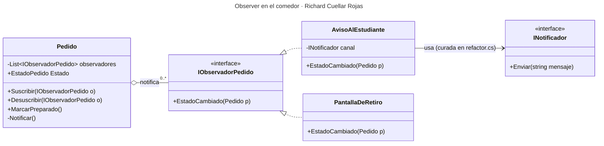

# Parte 3 — El patrón: Observer

**Autor:** Richard Cuellar Rojas · Comedor "Sabor Andino"

## 1. El requerimiento que lo pide a gritos

"Cuando un pedido queda **preparado**, el estudiante debe **recibir un aviso**."

Tiene la forma exacta del problema que resuelve Observer: **un objeto cambia de estado** (el `Pedido` pasa a PREPARADO) y **otros tienen que enterarse** (el estudiante hoy; mañana quizá una pantalla de retiro o WhatsApp), sin que el que cambia sepa quiénes son.

## 2. El patrón: **Observer** (comportamiento)

| Rol del patrón | Clase del comedor |
|---|---|
| Sujeto (Subject) | `Pedido` — guarda la lista de observadores y los notifica al cambiar de estado |
| Observador (Observer) | `IObservadorPedido` — contrato `EstadoCambiado(Pedido)` |
| Observador concreto | `AvisoAlEstudiante` — si el estado es PREPARADO, avisa por `INotificador` |
| Observador concreto (extensión) | `PantallaDeRetiro` — demuestra que se agrega otro sin tocar `Pedido` |

## 3. Diseño



### Código (C#, nombres del comedor)

```csharp
public enum EstadoPedido { Solicitado, Preparado, Entregado, Anulado }

public record Estudiante(string Codigo, string Nombre, string Correo);

// Observador: lo único que Pedido conoce de quienes lo escuchan.
public interface IObservadorPedido
{
    void EstadoCambiado(Pedido pedido);
}

// Sujeto
public class Pedido
{
    private readonly List<IObservadorPedido> _observadores = new();

    public int Id { get; }
    public Estudiante Estudiante { get; }
    public int Cantidad { get; }
    public EstadoPedido Estado { get; private set; } = EstadoPedido.Solicitado;
    // ...tipo de menú y precioUnitario: ver diagrama.md

    public Pedido(int id, Estudiante estudiante, int cantidad)
    {
        if (cantidad < 1) throw new ArgumentException("Un pedido lleva uno o más menús.");
        Id = id; Estudiante = estudiante; Cantidad = cantidad;
    }

    public void Suscribir(IObservadorPedido o)   => _observadores.Add(o);
    public void Desuscribir(IObservadorPedido o) => _observadores.Remove(o);

    public void MarcarPreparado()
    {
        if (Estado != EstadoPedido.Solicitado)
            throw new InvalidOperationException($"No se puede preparar un pedido {Estado}.");
        CambiarEstado(EstadoPedido.Preparado);
    }

    public void MarcarEntregado()
    {
        if (Estado != EstadoPedido.Preparado)
            throw new InvalidOperationException($"No se puede entregar un pedido {Estado}.");
        CambiarEstado(EstadoPedido.Entregado);
    }

    public void Anular()
    {
        if (Estado is EstadoPedido.Entregado or EstadoPedido.Anulado)
            throw new InvalidOperationException($"No se puede anular un pedido {Estado}.");
        CambiarEstado(EstadoPedido.Anulado);
    }

    private void CambiarEstado(EstadoPedido nuevo)
    {
        Estado = nuevo;
        Notificar();
    }

    private void Notificar()
    {
        foreach (var o in _observadores.ToArray())   // copia: un observador puede desuscribirse al ser notificado
        {
            try { o.EstadoCambiado(this); }
            catch (Exception ex) { Console.WriteLine($"[AVISO FALLIDO] {o.GetType().Name}: {ex.Message}"); }
        }
    }
}

// Observador concreto: el aviso del requerimiento.
public class AvisoAlEstudiante : IObservadorPedido
{
    private readonly INotificador _canal;              // la abstracción curada en refactor.cs
    public AvisoAlEstudiante(INotificador canal) => _canal = canal;

    public void EstadoCambiado(Pedido pedido)
    {
        if (pedido.Estado != EstadoPedido.Preparado) return;
        _canal.Enviar($"{pedido.Estudiante.Nombre}: tu pedido #{pedido.Id} ({pedido.Cantidad} menú/s) está listo. Pasá a recogerlo.");
    }
}

// Segundo observador: entra SIN modificar Pedido.
public class PantallaDeRetiro : IObservadorPedido
{
    public void EstadoCambiado(Pedido pedido)
    {
        if (pedido.Estado == EstadoPedido.Preparado)
            Console.WriteLine($"[PANTALLA] Pedido #{pedido.Id} LISTO — {pedido.Estudiante.Nombre}");
    }
}
```

Uso (`Program.cs`): al registrar el pedido (cajero), los observadores se conectan una sola vez.

```csharp
var pedido = new Pedido(101, new Estudiante("2021-0042", "Noelia", "noelia@uni.edu.bo"), 2);
pedido.Suscribir(new AvisoAlEstudiante(new CorreoUniversitario()));
pedido.Suscribir(new PantallaDeRetiro());

pedido.MarcarPreparado();
// [CORREO] Noelia: tu pedido #101 (2 menú/s) está listo. Pasá a recogerlo.
// [PANTALLA] Pedido #101 LISTO — Noelia
```

**Dónde entra en el sistema:** en `diagrama.md`, `Pedido` es el sujeto y `IObservadorPedido` / `AvisoAlEstudiante` son las clases del aviso. La conexión (`Suscribir`) se hace donde el cajero registra el pedido, que es la raíz de composición, igual que en el `Demo` de `refactor.cs`.

## 4. Justificación

### ¿Por qué ESE patrón?

- **Relación uno-a-muchos disparada por un cambio de estado.** Eso define a Observer. Un pedido preparado puede interesar a varios (estudiante, pantalla, y en el futuro la cocina o el reporte) y `Pedido` no debería saber cuántos son ni quiénes.
- **El canal de aviso va a cambiar y el `Pedido` no.** Correo hoy, WhatsApp o pantalla mañana. Con Observer, cada canal nuevo es **una clase nueva**, y `Pedido` queda cerrado a modificación.
- **Los otros patrones del curso no resuelven "avisar cuando algo pasa":**
  - *Strategy* intercambia un **algoritmo** (serviría para calcular precios por tipo), no reacciona a eventos.
  - *Decorator* agrega comportamiento envolviendo **un** objeto. Encadenar decoradores de aviso sobre `Pedido` complica la creación y no modela suscribirse o desuscribirse.
  - *Adapter* serviría para envolver la API de un proveedor de correo, pero no decide **cuándo** avisar.

### ¿Qué pasa SIN él? (el dolor real)

Sin Observer, lo natural es escribir el aviso dentro del propio pedido:

```csharp
public void MarcarPreparado()
{
    Estado = EstadoPedido.Preparado;
    new CorreoUniversitario().Enviar($"{Estudiante.Nombre}: tu pedido está listo");  // ← la misma enfermedad del esqueleto
}
```

Así se **reinfectan las 3 violaciones de la Parte 2**, ahora en la entidad central del dominio:

- **SRP:** `Pedido` maneja su ciclo de vida y además la mensajería.
- **OCP:** agregar la pantalla de retiro o WhatsApp obliga a abrir y modificar `Pedido` cada vez.
- **DIP:** `Pedido` depende de `CorreoUniversitario` concreto. No se puede probar `MarcarPreparado()` sin mandar correos reales.

La otra salida, que el estudiante pregunte cada tanto "¿ya está?" (pedido), carga la base de datos justo en la hora pico del almuerzo y el aviso llega tarde.


