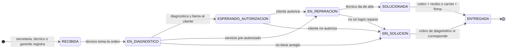
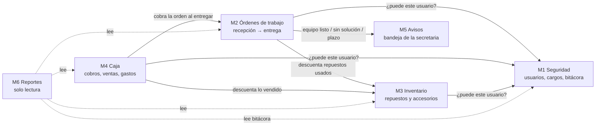
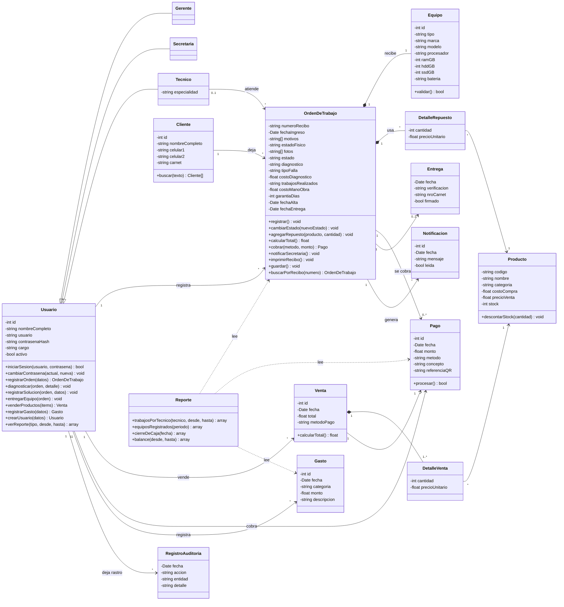

# H1 — Inventario del caso

**Estuadiante:** Richard Cuellar Rojas · **Variante 6:** Órdenes de trabajo — "Taller y soporte técnico"

---

## 0. Cómo funciona hoy el taller (sin sistema)

El taller repara laptops y PC de escritorio: fallas **electrónicas** (cambio de componentes), fallas de **software**, **mantenimiento** y **actualizaciones** (RAM, SSD, sistema operativo). Todo se anota en una hoja llamada **informe técnico**. Los cobros son en **efectivo** o por **QR**. De ese proceso salen las reglas de negocio que el sistema tiene que respetar:

| Código | Regla de negocio |
|---|---|
| RN1 | Cada equipo que entra genera una **orden con número de recibo único**. Si un cliente deja 3 equipos, se generan 3 órdenes (cada una tiene su técnico, estado, costo y garantía) y se imprimen juntas. |
| RN2 | Del cliente se registra **nombre completo** y **dos celulares** (el primero es obligatorio). |
| RN3 | Del equipo: tipo (laptop / PC de escritorio), marca, modelo, procesador, RAM, HDD y SSD. En laptops: si la **batería es interna** se anota que queda en el equipo; si es **externa** se le devuelve al cliente. |
| RN4 | Se registra el **estado físico** (pernos faltantes, golpes, daños) y al menos **una fotografía** del equipo. |
| RN5 | Se registran uno o varios **motivos**: no enciende, ingreso de líquido, bisagra rota, pantalla dañada, teclado, batería, falla de software, actualizar SO, cambio a SSD, aumento de RAM, mantenimiento, otro. |
| RN6 | Los técnicos atienden **por orden de llegada**: toman la orden por número de recibo, diagnostican y **llaman al cliente para que autorice** el trabajo. Lo que el cliente pidió directamente (mantenimiento, instalar SO, cambio a SSD o RAM) entra **pre-autorizado**. |
| RN7 | Si el cliente **no autoriza** y la falla es **electrónica**, se cobra el **diagnóstico**. |
| RN8 | Al **dar de alta**, el técnico registra qué hizo (componente cambiado, RAM o SSD actualizado, reinstalación del SO, licencias de Windows, Office y antivirus, clonación de HDD a SSD), los **repuestos que sacó del inventario**, el **costo de mano de obra** y la **garantía**. Si no logró solucionar, igual registra lo que hizo y el equipo se devuelve. |
| RN9 | Cuando una orden queda **solucionada** o **sin solución**, el sistema **avisa a la secretaria** para que llame al cliente. |
| RN10 | Un equipo puede quedarse **máximo 6 meses** en el taller desde que ingresó; el sistema alerta antes de que venza el plazo. |
| RN11 | Para retirar, el cliente presenta el **recibo de ingreso**; si lo perdió, presenta su **carnet** y se guarda una copia. Firma el **recibo de entrega**, que detalla el trabajo, la garantía y el costo. |
| RN12 | Cada cobro, venta y gasto queda **a nombre del usuario** que lo registró. Cada persona entra con su **usuario personal**. |
| RN13 | La secretaria solo ve el **precio de venta** de los productos. El **costo de compra** (capital) y los **cambios de precio** (rebajas) son del gerente. |
| RN14 | Personal: **1 o 2 gerentes**, **hasta 2 secretarias**, **2 o más técnicos**. El gerente crea los usuarios y **asigna los cargos**; cada usuario tiene un solo cargo. |
| RN15 | Gastos del taller: luz, agua, internet, comida y compra de repuestos o accesorios. Todos se registran como egresos. |

---

## 1. Actores

| Actor | Tipo | Qué quiere | Qué hace en el sistema |
|---|---|---|---|
| **Gerente** (1 o 2) — *supervisor* | Usuario | Controlar el negocio: saber qué hizo cada uno, cuánto entró y salió, y cuánto capital hay en repuestos. | Crea usuarios y asigna cargos; administra inventario y precios (rebajas); corrige o elimina registros; ve todos los reportes, el balance y la bitácora. También puede registrar órdenes, ventas, gastos y entregas con su propio usuario. |
| **Secretaria** (hasta 2) — *operador* | Usuario | Atender rápido el mostrador y que la caja del día cuadre. | Registra clientes y equipos; busca órdenes por recibo, nombre o celular; entrega equipos y cobra (efectivo o QR); vende accesorios; registra gastos; da de alta productos; recibe los avisos para llamar a clientes; saca el cierre de caja del día. |
| **Técnico** (2 o más) | Usuario | Saber qué equipo sigue, tener los datos del equipo a mano y que su trabajo quede a su nombre. | Toma órdenes por número de recibo, diagnostica, registra la respuesta del cliente, registra la solución, los repuestos usados, la mano de obra y la garantía, y da de alta (solucionado o sin solución). También puede registrar equipos. |
| **Cliente** | Persona externa (no usa el sistema) | Saber cuándo está listo su equipo, cuánto cuesta y que se lo entreguen solo a él. | Deja y retira equipos, autoriza trabajos por teléfono, paga en efectivo o QR, firma el recibo de entrega. |
| **API de cobro QR del banco** | Sistema externo | — | Genera el QR de cobro y confirma si el pago entró. |
| **Impresora de recibos** | Dispositivo externo | — | Imprime el recibo de ingreso y el recibo de entrega. |

### Matriz de permisos (RF4)

| Acción | Gerente | Secretaria | Técnico |
|---|:-:|:-:|:-:|
| Registrar cliente, equipo y orden | ✔ | ✔ | ✔ |
| Buscar órdenes (recibo, nombre, celular, estado) | ✔ | ✔ | ✔ |
| Tomar orden, diagnosticar, registrar solución, repuestos usados y mano de obra | — | — | ✔ *(solo sus órdenes)* |
| Reasignar una orden a otro técnico | ✔ | — | — |
| Entregar equipo y cobrar (efectivo / QR) | ✔ | ✔ | — |
| Vender accesorios y repuestos en mostrador | ✔ | ✔ | — |
| Registrar gastos y egresos | ✔ | ✔ | — |
| Consultar stock y precio de venta | ✔ | ✔ | ✔ |
| Dar de alta productos en inventario | ✔ | ✔ | — |
| Editar o eliminar productos y registros; cambiar precios (rebajas) | ✔ | — | — |
| Ver costo de compra y capital en inventario | ✔ | — | — |
| Crear usuarios y asignar cargos | ✔ | — | — |
| Cambiar su propia contraseña | ✔ | ✔ | ✔ |
| Recibir avisos (listo / sin solución / plazo de 6 meses) | ✔ | ✔ | — |
| Reporte de trabajos por técnico | ✔ *(todos)* | — | ✔ *(solo el suyo)* |
| Reporte de equipos registrados (día, semana, mes, año) | ✔ | ✔ | — |
| Cierre de caja del día | ✔ | ✔ | — |
| Balance de ingresos y egresos | ✔ | — | — |
| Ver bitácora (quién registró qué) | ✔ | — | — |

---

## 2. Los 6 requerimientos funcionales aterrizados al taller

| RF | En mi taller |
|---|---|
| **RF1 Registrar** | Registrar una **orden de trabajo**: cliente (nombre completo, 2 celulares), equipo (tipo, marca, modelo, procesador, RAM, HDD, SSD, batería), motivos, estado físico, fotos, fecha de ingreso y usuario que la registró. Validaciones: celular de 8 dígitos que empiece con 6 o 7, al menos un motivo, al menos una foto, laptop con tipo de batería. |
| **RF2 Listar y buscar** | Buscar por **número de recibo**; si el cliente lo perdió, por **nombre** o **celular**. Listar por **estado**, **técnico** y **rango de fechas**. Cola de trabajo del técnico ordenada por fecha de ingreso. |
| **RF3 Flujo de estados** | Ver diagrama abajo. Ninguna orden puede saltarse estados (por ejemplo, entregarse sin haber sido dada de alta). |
| **RF4 Roles** | Gerente (*supervisor*), Secretaria (*operador*) y Técnico, con la matriz de arriba. |
| **RF5 Notificar** | Al pasar a **SOLUCIONADA** o **SIN_SOLUCION** se genera un aviso para las secretarias ("llamar a X, cobrar Bs Y"). Una revisión diaria avisa cuando una orden se acerca al plazo de **6 meses** o lo supera. |
| **RF6 Reportar** | Trabajos por técnico con fechas · equipos registrados por día, semana, mes y año · cierre de caja diario (ingresos por concepto y por método: efectivo vs QR, y gastos) · balance de ingresos y egresos · ventas y cobros por usuario · órdenes por vencer. |

### Flujo de estados de la orden (RF3)

Equivalencia con la consigna: *recibida → diagnosticada → en reparación → lista → entregada*. En mi taller aparecen dos estados más porque el técnico **llama al cliente para autorizar** (RN6) y porque a veces **no hay solución** y el equipo se devuelve igual.

---

## 3. Inventario de módulos

| # | Módulo | Responsabilidad única |
|---|---|---|
| M1 | **Seguridad** | Decidir **quién es quién y qué puede hacer**: autenticación, usuarios, cargos, contraseñas y bitácora de auditoría. |
| M2 | **Órdenes de trabajo** | Llevar cada equipo **desde que entra hasta que sale**: cliente, equipo, recepción, diagnóstico, autorización, solución, entrega y sus estados. |
| M3 | **Inventario** | Mantener los **repuestos y accesorios**: stock, costo de compra y precio de venta. |
| M4 | **Caja** | Registrar **todo el dinero que entra y sale**: cobros de órdenes y diagnósticos, ventas de mostrador (efectivo / QR) y gastos. |
| M5 | **Avisos** | Hacer llegar a la persona correcta **lo que tiene que atender**: equipo listo, sin solución, plazo por vencer. |
| M6 | **Reportes** | Resumir la información **para decidir**: por período, por usuario, por estado. Solo lee, nunca modifica. |

---

## 4. Primer diagrama de clases

### Coherencia módulos ↔ clases

| Módulo | Clases que le pertenecen |
|---|---|
| M1 Seguridad | `Usuario`, `Gerente`, `Secretaria`, `Tecnico`, `RegistroAuditoria` |
| M2 Órdenes de trabajo | `Cliente`, `Equipo`, `OrdenDeTrabajo`, `Entrega` |
| M3 Inventario | `Producto`, `DetalleRepuesto` |
| M4 Caja | `Pago`, `Venta`, `DetalleVenta`, `Gasto` |
| M5 Avisos | `Notificacion` |
| M6 Reportes | `Reporte` |

Cada clase pertenece a un solo módulo y ningún módulo queda sin clases. `DetalleRepuesto` está en Inventario porque es el punto donde una orden **consume stock**.

---

## 5. Los 2 atributos de calidad críticos

Ratifico **fiabilidad** y cambio *mantenibilidad* por **seguridad**. El argumento está abajo.

### 1) Seguridad — control de acceso y trazabilidad

En el taller circula **efectivo**, hay **equipos ajenos** y datos de muchos clientes. El gerente pidió explícitamente que cada trabajo, venta, cobro y gasto quede a nombre de quien lo hizo, que la secretaria no vea costos de compra y que un equipo **solo se entregue a quien presenta el recibo o su carnet**. Si esto falla, el daño es directo: plata que no cuadra o una laptop entregada a otra persona.
*Cómo lo mido:* 100 % de operaciones con autor en la bitácora; 0 accesos al costo de compra desde el cargo Secretaria; 0 entregas sin recibo ni carnet.

### 2) Fiabilidad — integridad de las órdenes y de la caja

El sistema **reemplaza la hoja de papel**: si pierde una orden, un estado o un aviso, el taller pierde un equipo o un cliente. Ninguna orden puede saltarse estados, cada equipo listo tiene que generar un aviso para que alguien llame, el plazo de 6 meses no puede pasar sin alerta, y el cierre del día tiene que coincidir con el efectivo contado.
*Cómo lo mido:* 0 transiciones inválidas aceptadas; 100 % de órdenes solucionadas o sin solución con aviso generado; diferencia de caja = 0 al cierre.

