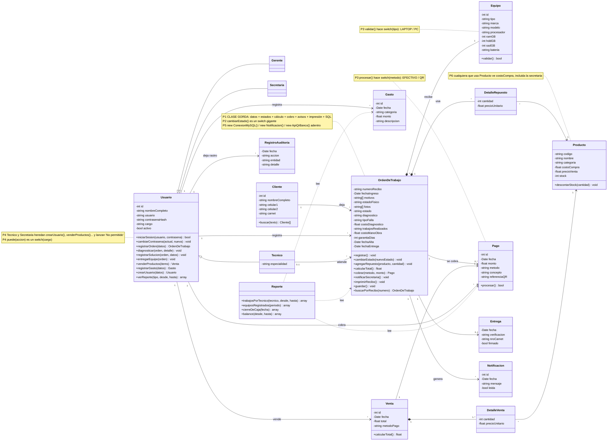
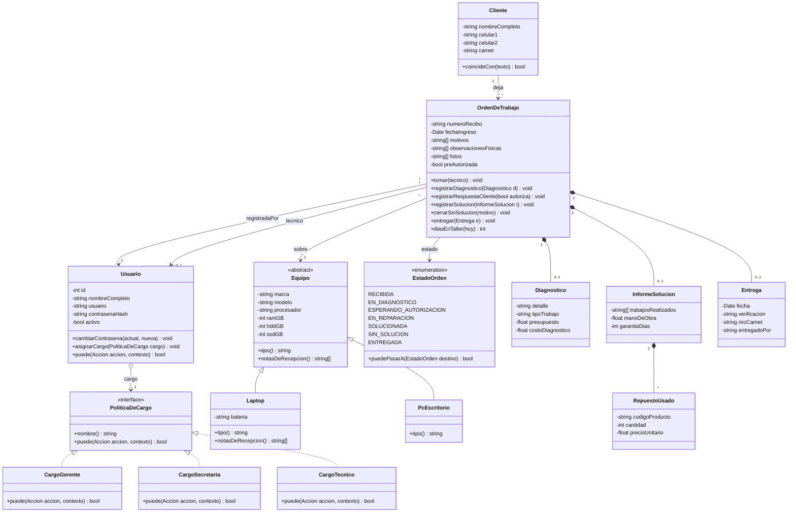
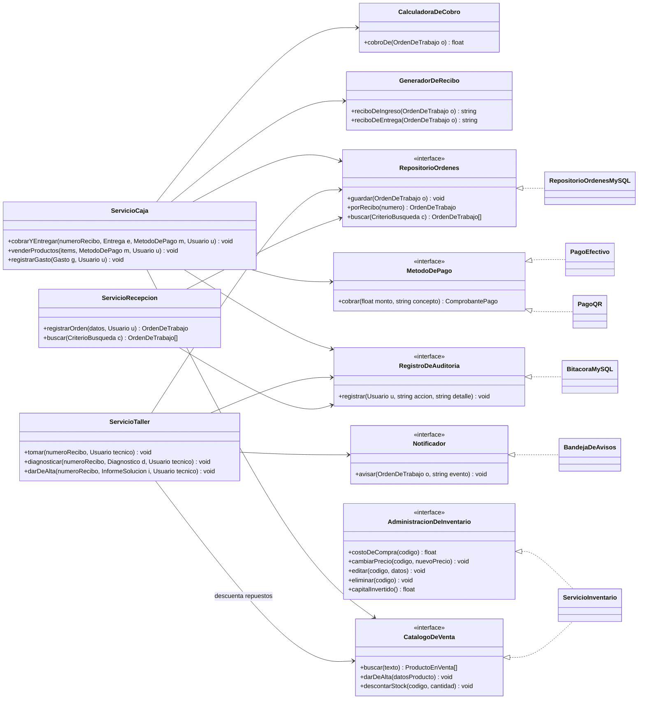

# H2 — Diagrama de clases con SOLID aplicado (antes / después)

**Estudiante:** Richard Cuellar Rojas · **Variante 6:** Taller y soporte técnico

---

## 1. ANTES — mi diagrama del H1, con sus problemas a la vista

Es el mismo diagrama del H1, sin retoques. Solo le agregué notas donde están los problemas (P1 a P6).

### Diagnóstico

| # | Problema | Dónde duele en el taller | Principio violado |
|---|---|---|---|
| P1 | `OrdenDeTrabajo` hace de todo: guarda datos, cambia estados, calcula el total, cobra, avisa, imprime y escribe en MySQL. | Si cambia el formato del recibo impreso hay que abrir la misma clase que controla los estados y el dinero. | **SRP** |
| P2 | `cambiarEstado()` con `switch` sobre el estado. | Cada estado nuevo (por ejemplo, "esperando repuesto") obliga a editar el `switch` y arriesga romper los demás. | **OCP** |
| P3 | `switch(tipo)` en `Equipo.validar()` y `switch(metodo)` en `Pago.procesar()`. | Un tipo de equipo nuevo (All-in-one) o un segundo banco para QR obliga a tocar clases que ya funcionan. | **OCP** |
| P4 | `Tecnico` y `Secretaria` heredan métodos que no pueden usar y los anulan con `throw`. | No puedo usar un `Tecnico` donde se espera un `Usuario` sin que explote. Y cuando el gerente **cambia el cargo** de alguien, el objeto no puede cambiar de clase: habría que borrar el usuario y perder su historial. | **LSP** (y ISP) |
| P5 | `new ConexionMySQL()`, `new ApiQrBanco()`, `new Notificacion()` dentro de las clases de negocio. | La lógica del taller queda atada a MySQL y a un banco concreto; no se puede probar sin base de datos ni cambiar de banco. | **DIP** |
| P6 | Una sola clase `Producto` con `costoCompra` para todos los que la usan. | La pantalla de la secretaria tiene a mano el costo de compra aunque la regla RN13 dice que solo ve el precio de venta. | **ISP** |

---

## 2. DESPUÉS — SOLID aplicado

Es un solo modelo, pero lo dibujo en **dos vistas** para que se pueda leer: (A) dominio y seguridad, (B) servicios y contratos.

### Vista A — Dominio y seguridad

### Vista B — Servicios y contratos (las flechas apuntan a interfaces)

> Pantalla de la secretaria → depende solo de `CatalogoDeVenta`. Pantalla del gerente → depende de `AdministracionDeInventario`. Además, cada servicio consulta `usuario.puede(accion)` antes de actuar: la regla se valida en el servidor, no solo ocultando botones.

---

## 3. Qué cambié y qué principio me pidió cada cambio

1. **SRP** — Partí la `OrdenDeTrabajo` gorda: ahora solo guarda sus datos y sus reglas de estado; el cobro pasó a `CalculadoraDeCobro`, la persistencia a `RepositorioOrdenes`, los avisos a `Notificador`, la impresión a `GeneradorDeRecibo`, y el diagnóstico, la solución y la entrega son clases propias.
2. **OCP** — El `switch(tipo)` de `Equipo` se volvió la jerarquía `Laptop` / `PcEscritorio` (la regla de la batería vive en `Laptop`); el `switch` de estados, una tabla de transiciones en `EstadoOrden`; el `switch(metodo)` de pago, la interfaz `MetodoDePago`. Un tipo, estado o banco nuevo es una clase o una fila nueva, no un `case` más.
3. **LSP** — `Tecnico` y `Secretaria` ya no heredan métodos que anulan con `throw`: `Usuario` **tiene** un cargo (`PoliticaDeCargo`) y cualquier cargo cumple el contrato completo. De paso, el gerente puede cambiar el cargo de alguien sin borrar al usuario ni su historial.
4. **ISP** — El inventario se partió en `CatalogoDeVenta` (precio de venta, alta, stock: secretaria y técnico) y `AdministracionDeInventario` (costo, rebajas, editar, eliminar: gerente); quien no debe ver el costo ni siquiera depende de un método que lo devuelva.
5. **DIP** — Los `new ConexionMySQL()`, `new ApiQrBanco()` y `new Notificacion()` incrustados desaparecieron: los servicios reciben interfaces por constructor y MySQL, el banco y la bandeja quedan como detalles intercambiables (y probables sin base de datos).

