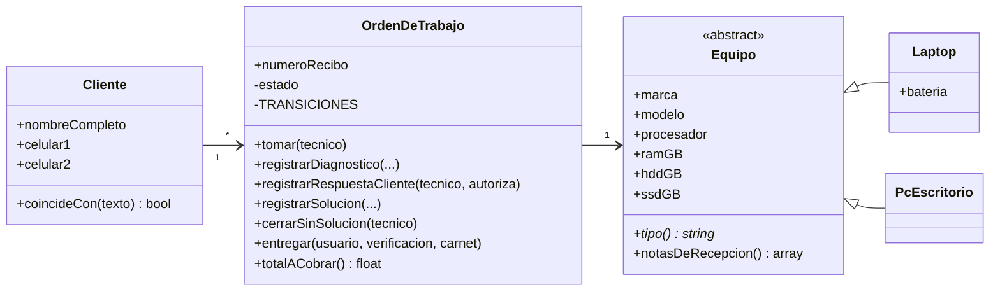

# h3/base — El corazón del caso, SIN patrones

Cinco clases transcritas de la [vista A del H2](../../h2/README.md#vista-a--dominio-y-seguridad): lo mínimo para recibir un equipo, llevarlo por sus estados y entregarlo. Todas las carpetas `con-*/` parten de una **copia exacta** de estos archivos.

| Clase | Responsabilidad | Regla del negocio que protege |
|---|---|---|
| `Cliente` | Datos del cliente y búsqueda por nombre o celular | RN2 (celular boliviano de 8 dígitos), RF2 |
| `Equipo` *(abstracta)* | Datos técnicos comunes | RN3 |
| `Laptop` | Regla de la batería interna / externa | RN3 |
| `PcEscritorio` | Equipo sin batería | RN3 |
| `OrdenDeTrabajo` | Flujo de estados con tabla de transiciones; solo el técnico asignado registra trabajo | RN1, RN4-RN8, RN11, RF3 |



## Ejecutar

```bash
php h3/base/demo.php
```

## Lo que queda pendiente a propósito (y qué carpeta lo resuelve)

| Síntoma en la base | Dónde está | Lo ataca |
|---|---|---|
| `equipoDesdeFormulario()` decide con `if` qué clase crear | `demo.php` | [`con-factory/`](../con-factory/) |
| Constructor de `OrdenDeTrabajo` con 11 parámetros, varios opcionales | `OrdenDeTrabajo::__construct` | [`con-builder/`](../con-builder/) |
| No hay forma de cobrar con el QR del banco | — | [`con-adapter/`](../con-adapter/) |
| Nadie se entera cuando una orden queda lista | — | [`con-observer/`](../con-observer/) |
| `totalACobrar()` es un `if/else` según cómo terminó la orden | `OrdenDeTrabajo::totalACobrar` | [`con-strategy/`](../con-strategy/) |
| Licencias y extras del servicio no tienen precio propio | — | [`con-decorator/`](../con-decorator/) |
