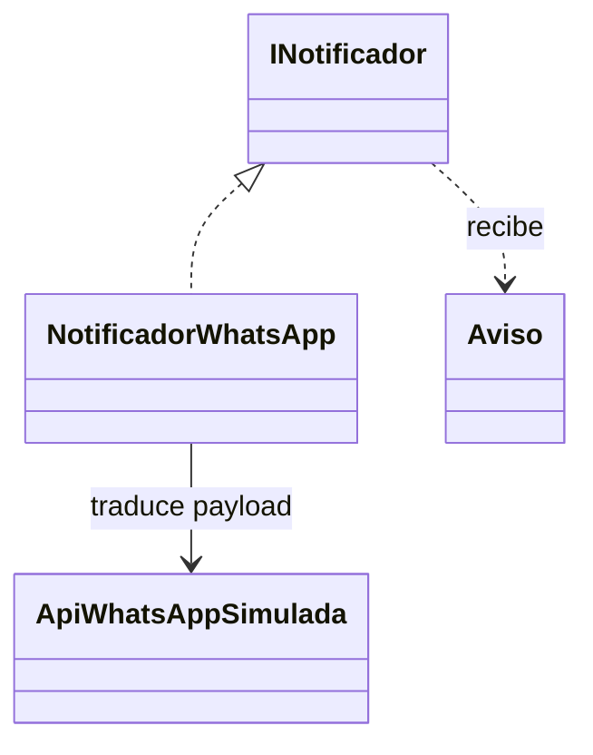

# Adapter - Aviso de equipo listo

El H2 define Aviso, INotificador y NotificadorWhatsApp. Esta variante incorpora esos elementos sobre la copia del nucleo y agrega ApiWhatsAppSimulada como proveedor de prueba.

| Participante | Implementacion |
| --- | --- |
| Cliente | avisarEquipoListo(), funcion de demo.php |
| Contrato esperado (Target) | INotificador::enviar(Aviso) |
| Adaptador | NotificadorWhatsApp |
| Proveedor incompatible (Adaptee) | ApiWhatsAppSimulada::sendMessage(array) |

NotificadorWhatsApp recibe el proveedor por constructor y convierte destinatario -> to, tipo y mensaje -> body, fecha -> sent_at en formato ISO 8601. La API registra el payload en memoria. No es una integracion real con Meta ni hace peticiones de red.

La funcion cliente comprueba que la orden este lista y depende de INotificador. El aviso se llama explicitamente despues de cambiar el estado: no hay suscriptores, eventos publicados ni Observer. Las cinco clases base estan intactas. La orden y el equipo se crean con new, sin Factory ni Builder.

El beneficio es aislar la interfaz externa; en produccion faltarian credenciales, manejo de errores, reintentos y prevencion de avisos duplicados. Ninguna de esas funciones se afirma implementada.

Ejecutar: `php H3/con-adapter/demo.php`.

