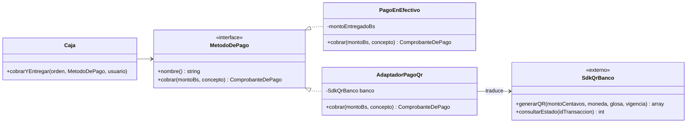

# h3/con-adapter — Adapter

**Copia de `base/` + Adapter.** Las 5 clases de la base no se tocaron.

## El problema en mi taller

El taller cobra en **efectivo** y por **QR**. El QR lo genera el banco con su propia librería, que **no podemos modificar** y que habla otro idioma: montos en centavos, moneda como texto, respuestas en arreglos, estados con códigos `0/1/2`, glosa de 25 caracteres sin tildes. Si Caja usara esa librería directamente, quedaría atada a ese banco (el `new ApiQrBanco()` que ya critiqué en el H2, problema P5).

## La solución

| Rol del patrón | Clase |
|---|---|
| Objetivo (*Target*) | `MetodoDePago` (el contrato del H2) |
| Adaptado (*Adaptee*) | `externo/SdkQrBanco` (simula la librería del banco; no se toca) |
| Adaptador | `AdaptadorPagoQr` |
| Cliente del patrón | la función `cobrarYEntregar()` de Caja en `demo.php` |
| Implementación nativa | `PagoEnEfectivo` (ya habla el idioma del taller) |



## Ejecutar

```bash
php h3/con-adapter/demo.php
```

La demo muestra: un cobro por QR, un cobro en efectivo con vuelto (mismo código de Caja) y un QR que expira sin pago, en cuyo caso **el equipo no se entrega** (la orden sigue `SOLUCIONADA`).

## Qué gané / qué pagué

- **Gané:** Caja no sabe que existe un banco. Cambiar de banco o agregar un segundo proveedor de QR = otro adaptador. La lógica de "no entregar si el QR no se confirmó" queda en un solo lugar.
- **Pagué:** una capa de traducción que hay que mantener si el banco cambia su librería. En la app real la confirmación del pago llega por consulta periódica o *callback*, cosa que la simulación simplifica.
