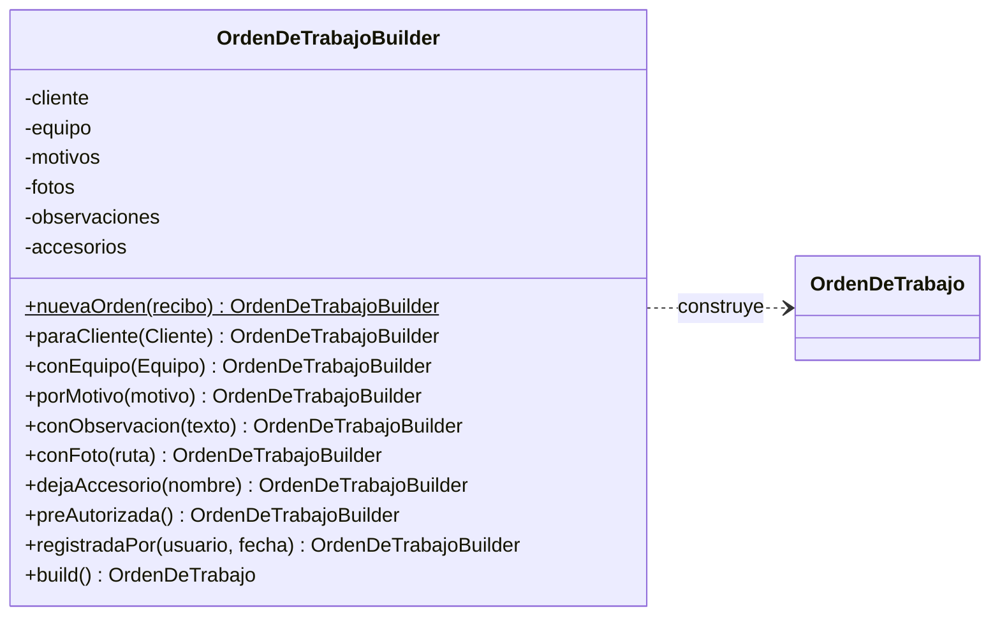

# h3/con-builder — Builder

**Copia de `base/` + Builder.** Las 5 clases de la base no se tocaron.

## El problema en mi taller

La hoja de informe técnico tiene muchos campos: 6 obligatorios (recibo, cliente, equipo, al menos un motivo, al menos una foto, quién registra) y varios opcionales (lo que cuenta el cliente, observaciones del estado físico, accesorios que deja, pre-autorización). En la base eso es un constructor de **11 parámetros posicionales**: con tres arreglos seguidos (`observaciones`, `fotos`, `accesorios`) es muy fácil pasar las fotos donde iban los accesorios sin que nada falle.

## La solución

| Rol del patrón | Clase |
|---|---|
| Builder | `OrdenDeTrabajoBuilder` (métodos con nombre del negocio: `porMotivo()`, `conObservacion()`, `conFoto()`, `dejaAccesorio()`, `preAutorizada()`...) |
| Producto | `OrdenDeTrabajo` |
| Director | el formulario de recepción (en la demo, `demo.php`) |

`build()` revisa los obligatorios y **lista todo lo que falta de una sola vez**, que es lo que necesita la pantalla de la secretaria. La orden sigue validando sus reglas propias (motivos válidos, que solo los servicios directos entren pre-autorizados).



## Ejecutar

```bash
php h3/con-builder/demo.php
```

## Qué gané / qué pagué

- **Gané:** construcción legible y paso a paso (como se llena el formulario), campos acumulables (varios motivos, varias fotos) y un mensaje con todos los faltantes.
- **Pagué:** una clase más que repite los campos de la orden. PHP 8 ya tiene *named arguments*, que resuelven parte del problema de legibilidad; el Builder se justifica por la validación acumulada y por los campos que se agregan de a uno.
