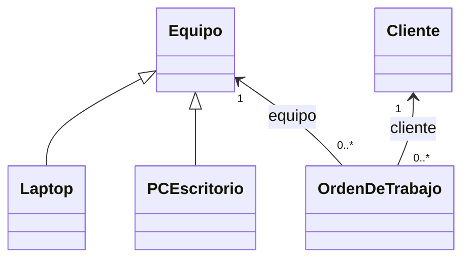

# Base sin patrones

Contiene cinco clases del H2: Cliente, Equipo (abstracta), Laptop, PCEscritorio y OrdenDeTrabajo. La abstraccion de Equipo y la herencia ya estaban en el H2; la creacion aqui es directa, sin Factory, Builder, Adapter ni Singleton.

La orden valida los datos obligatorios, el compromiso y las transiciones. Este es un nucleo en memoria; no guarda datos entre ejecuciones. Consulta el README principal para las simplificaciones respecto al H2.

Ejecuta desde la raiz del repositorio: `php H3/base/demo.php`.

