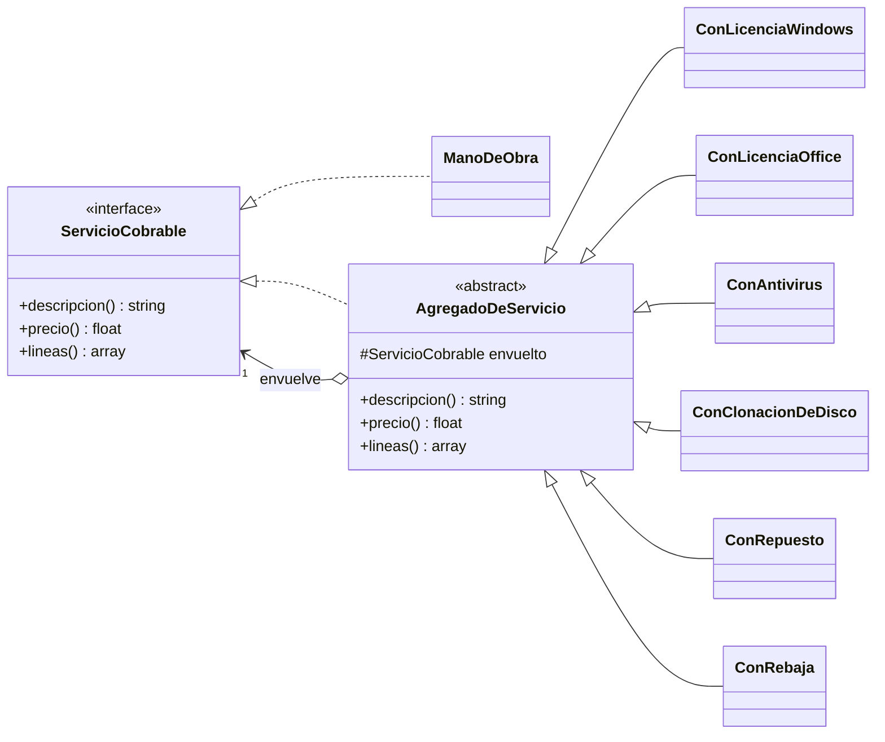

# h3/con-decorator — Decorator

**Copia de `base/` + Decorator.** Las 5 clases de la base no se tocaron; se agregaron 9 archivos.

## El problema que probé

Cuando el técnico reinstala el sistema operativo, el trabajo suele venir con **agregados**: licencia de Windows, licencia de Office, antivirus, clonación de HDD a SSD, un repuesto, a veces una **rebaja** que autoriza el gerente (RN8, RN13). Parecía el caso típico de Decorator: "apilar" agregados sobre la mano de obra, cada uno sumando su precio y su descripción.

## La implementación

| Rol del patrón | Clase |
|---|---|
| Componente | `ServicioCobrable` (interfaz) |
| Componente concreto | `ManoDeObra` |
| Decorador base | `AgregadoDeServicio` |
| Decoradores concretos | `ConLicenciaWindows`, `ConLicenciaOffice`, `ConAntivirus`, `ConClonacionDeDisco`, `ConRepuesto`, `ConRebaja` |

*(Los precios de licencias y antivirus son de ejemplo.)*



## Ejecutar

```bash
php h3/con-decorator/demo.php
```

## Lo que encontré (y por qué no lo elijo para la fusión)

Funciona: el total da bien. Pero la demo deja ver tres fricciones con mi dominio:

1. **Hay que desarmar la cadena.** La orden necesita *líneas separadas*: repuestos (para descontar inventario), trabajos (para el recibo) y mano de obra (para el reporte del técnico). Tuve que agregar `lineas()` y una bandera `esRepuesto` para aplanar los envoltorios en una lista: el Decorator terminó reimplementando una lista.
2. **Las licencias no son mano de obra**, pero al registrar la solución quedaron sumadas ahí porque la cadena no distingue tipos de ítem.
3. **El orden importa solo por la rebaja:** mismos agregados, dos totales distintos (Bs 474 vs Bs 459) según dónde se envolvió `ConRebaja`. Eso es un riesgo para la caja (atributo **fiabilidad**).

**Conclusión:** mi problema no es *apilar comportamiento* sino *sumar ítems*. Una lista de líneas del recibo (repuesto, licencia, mano de obra) más una rebaja aplicada siempre al final lo resuelve más simple. Lo registro como alternativa descartada en el [ADR-001](../../h4/adr-001.md).
