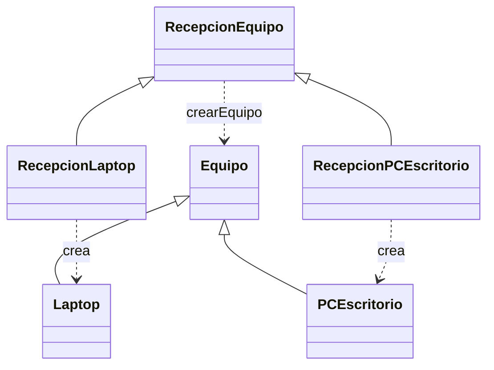

# Factory Method - Recepcion de equipos

La base construye equipos con `new Laptop(...)`. Aqui el metodo `registrarIngreso()` del creador abstracto llama a `crearEquipo()` sin decidir el subtipo. RecepcionLaptop y RecepcionPCEscritorio sobrescriben ese metodo y construyen su producto.

| Participante | Clase o metodo |
| --- | --- |
| Producto | Equipo |
| Productos concretos | Laptop, PCEscritorio |
| Creador | RecepcionEquipo |
| Creadores concretos | RecepcionLaptop, RecepcionPCEscritorio |
| Factory Method | crearEquipo(): Equipo |
| Operacion que usa el producto | registrarIngreso() |

Es Factory Method por la redefinicion del metodo de creacion en subclases. No es una fabrica estatica con un switch. El programa cliente elige el creador concreto; el flujo de registrarIngreso queda comun. Para otro equipo se agrega su subtipo y creador y se configura el cliente.

Las cinco clases de base se conservan identicas. No incorpora Builder ni Adapter. La clase RecepcionEquipo es un soporte nuevo del H3 para aislar la creacion; no sustituye todo ServicioRecepcion del H2, que ademas contempla permisos y busqueda.

Ejecutar: `php H3/con-factory/demo.php`.

