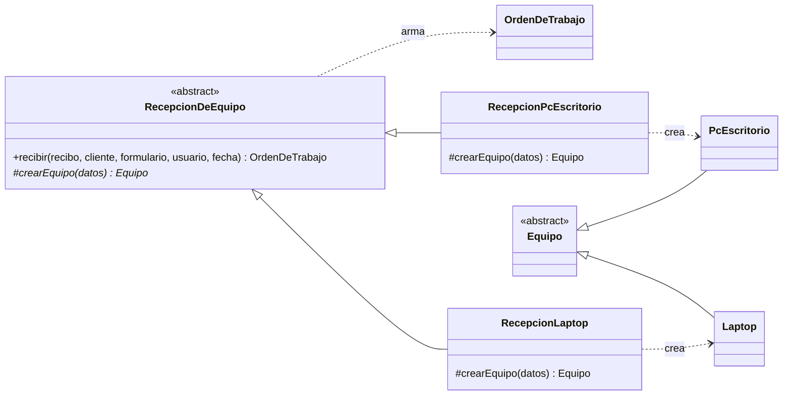

# h3/con-factory — Factory Method

**Copia de `base/` + Factory Method.** Las 5 clases de la base no se tocaron.

## El problema en mi taller

En la base, quien registra decide con un `if` qué equipo crear (`equipoDesdeFormulario()` en `base/demo.php`). Cada tipo nuevo que el taller empiece a recibir (All-in-one, mini PC) obliga a abrir ese `if`, y ahí también se mezclan validaciones que son de un tipo solo (la batería es cosa de laptops).

## La solución

| Rol del patrón | Clase |
|---|---|
| Producto | `Equipo` |
| Productos concretos | `Laptop`, `PcEscritorio` |
| Creador (con el *factory method* `crearEquipo()`) | `RecepcionDeEquipo` |
| Creadores concretos | `RecepcionLaptop`, `RecepcionPcEscritorio` |

`RecepcionDeEquipo::recibir()` es el trámite común (crear el equipo, armar la orden). Solo `crearEquipo()` cambia según el tipo, y lo implementa cada subclase.



## Ejecutar

```bash
php h3/con-factory/demo.php
```

## Qué gané / qué pagué

- **Gané:** un tipo de equipo nuevo = una clase `Equipo` + una clase `Recepcion...` + una línea en el mapa del formulario. El trámite de recepción no se toca (OCP).
- **Pagué:** una clase creadora por cada tipo. Con solo 2 tipos, es más código que el `if` original; se justifica si el taller empieza a recibir más tipos.
