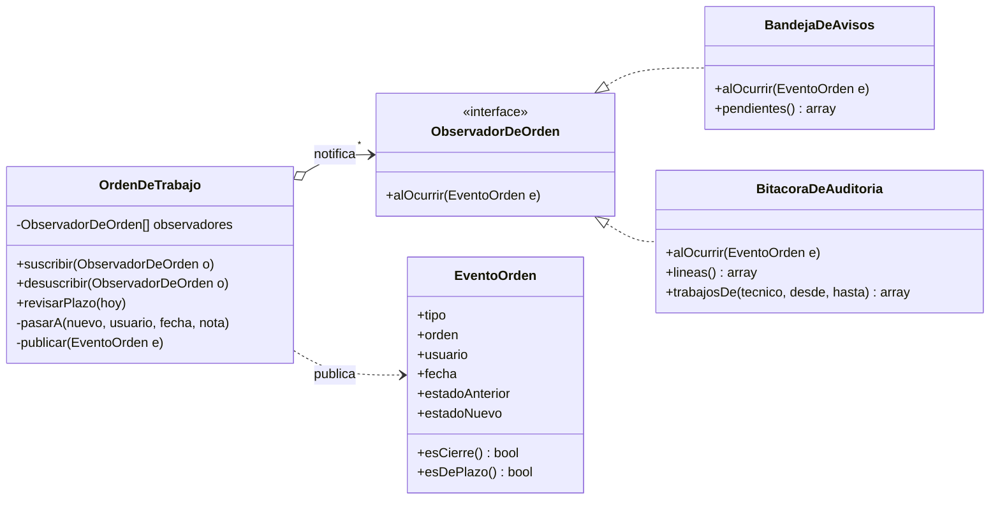

# h3/con-observer — Observer

**Copia de `base/` + Observer.** Cambió `OrdenDeTrabajo` (ahora es el sujeto) y se agregaron 4 archivos.

## El problema en mi taller

Cuando el técnico da de alta un equipo, **la secretaria tiene que enterarse para llamar al cliente** (RN9). Al mismo evento le interesan otros: el gerente quiere la **bitácora** de quién hizo qué (RN12) y el reporte de trabajos por técnico (RF6). Y una vez al día hay que revisar qué equipos se acercan al **plazo de 6 meses** (RN10). En el H1 esto era `notificarSecretaria()` con un `new Notificacion()` adentro de la orden: cada interesado nuevo obligaba a editar la clase central.

## La solución

| Rol del patrón | Clase |
|---|---|
| Sujeto | `OrdenDeTrabajo` (`suscribir()`, `desuscribir()`, `publicar()` privado) |
| Evento | `EventoOrden` (qué pasó, a qué orden, quién, cuándo) |
| Observador | `ObservadorDeOrden` (interfaz) |
| Observadores concretos | `BandejaDeAvisos` (secretarias), `BitacoraDeAuditoria` (gerente) |

La orden publica en **cada** cambio de estado y en `revisarPlazo($hoy)`, que llama la tarea programada de cada mañana. Cada observador decide qué eventos le importan: la bandeja solo los cierres y los plazos; la bitácora, todos.

Dos detalles de fiabilidad:

- La orden publica **después** de completar sus datos: el observador nunca ve una orden a medio llenar.
- Si un observador falla, el error se registra y **el cambio de estado no se pierde** (`try/catch` en `publicar()`).



## Ejecutar

```bash
php h3/con-observer/demo.php
```

## Qué gané / qué pagué

- **Gané:** un interesado nuevo (por ejemplo, avisar también al gerente cuando una orden queda sin solución, o un WhatsApp al cliente el día que el taller lo contrate) es una clase nueva y una línea de suscripción. La orden no se toca.
- **Pagué:** el flujo ya no se lee en un solo método (hay que saber quién está suscrito), y alguien tiene que suscribir los observadores cada vez que se crea o se carga una orden. En esta copia la bandeja todavía usa el `totalACobrar()` con `if/else` de la base; eso lo resuelve la fusión en `final/`
