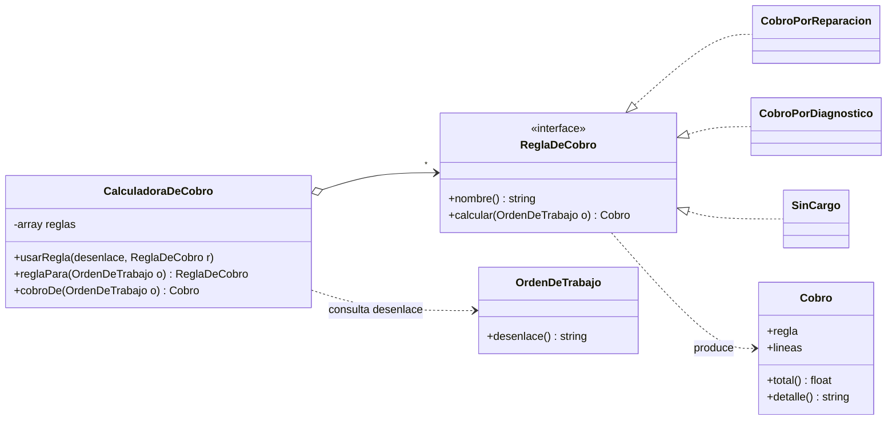

# h3/con-strategy — Strategy

**Copia de `base/` + Strategy.** En `OrdenDeTrabajo` se reemplazó `totalACobrar()` por `desenlace()`; se agregaron 6 archivos.

## El problema en mi taller

Lo que se cobra al entregar depende de **cómo terminó** la orden:

| Desenlace | Qué se cobra |
|---|---|
| Se reparó | mano de obra + cada repuesto sacado del inventario |
| El cliente no autorizó y la falla es **electrónica** | solo el diagnóstico (RN7) |
| El cliente no autorizó y la falla es de **software** | nada |
| No tiene reparación posible | nada (hoy) |

En la base eso es un `if/else` dentro de `OrdenDeTrabajo::totalACobrar()`. Cada vez que el gerente ajusta la política ("cobremos el diagnóstico también cuando no hay reparación posible") hay que abrir la clase central del sistema, la misma que controla los estados.

## La solución

| Rol del patrón | Clase |
|---|---|
| Estrategia | `ReglaDeCobro` (interfaz) |
| Estrategias concretas | `CobroPorReparacion`, `CobroPorDiagnostico` (contiene la condición "solo electrónica"), `SinCargo` |
| Contexto | `CalculadoraDeCobro` (tabla *desenlace → regla*; `usarRegla()` la cambia en caliente) |
| Resultado | `Cobro` (líneas para el recibo + total) |

La orden solo informa su `desenlace()`; no sabe de montos.



## Ejecutar

```bash
php h3/con-strategy/demo.php
```

La demo cobra 4 órdenes con la política vigente; después el gerente cambia **una** entrada de la tabla y solo cambia el monto de la orden afectada.

## Qué gané / qué pagué

- **Gané:** cada regla está aislada y se prueba sola; cambiar la política es cambiar una entrada de la tabla o agregar una clase, sin tocar `OrdenDeTrabajo` (OCP). El `Cobro` trae las líneas que necesita el recibo de entrega.
- **Pagué:** 6 archivos donde antes había un `if` de 8 líneas. Se justifica porque estas reglas son justo las que el gerente cambia, y un error en ellas descuadra la caja (atributo **fiabilidad**).
