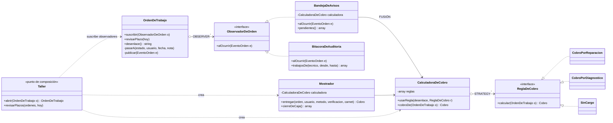

# h3/final — LA FUSIÓN: Observer + Strategy

> **Observer** decide **cuándo y a quién** avisar. **Strategy** decide **cuánto** cobrar. Los dos trabajan en el mismo flujo: el cierre de una orden de trabajo.

La decisión y sus alternativas están en el [ADR-001](../../h4/adr-001.md).

## Por qué estos dos (en una línea cada uno)

- **Observer:** cuando el técnico da de alta un equipo, a ese mismo evento le interesan **varios**: las secretarias (tienen que llamar al cliente, RN9), la bitácora del gerente (quién hizo qué, RN12) y el reporte por técnico (RF6). Y cada mañana la revisión del plazo de 6 meses (RN10) produce avisos del mismo tipo.
- **Strategy:** lo que se cobra **cambia según cómo terminó la orden** (reparada, rechazo electrónico, rechazo de software, sin arreglo) y esa política la ajusta el gerente.

## Cómo conviven (no son dos carpetas lado a lado)

```text
Técnico da de alta ──► OrdenDeTrabajo.pasarA(SOLUCIONADA)
                             │  (OBSERVER: el sujeto publica EventoOrden)
                ┌────────────┴─────────────┐
                ▼                          ▼
        BandejaDeAvisos             BitacoraDeAuditoria
                │                   "carlos cerró R-000801"
                │ (STRATEGY: pide el monto)
                ▼
        CalculadoraDeCobro ──► elige ReglaDeCobro por desenlace()
                │                (CobroPorReparacion / CobroPorDiagnostico / SinCargo)
                ▼
  "LISTO R-000801 — Llamar a Juan (71234567): cobrar Bs 350 (mano de obra 230 + IC 120)"

Cliente llega ──► Mostrador.entregar()
                     ├─ CalculadoraDeCobro (la MISMA regla → el mismo monto que dijo la secretaria)
                     └─ OrdenDeTrabajo.entregar() → publica ENTREGADA → bitácora: "ana cobró por QR"
```



## Archivos

| Archivo | Rol |
|---|---|
| `Cliente`, `Equipo`, `Laptop`, `PcEscritorio` | de la base, sin cambios |
| `OrdenDeTrabajo` | **sujeto** del Observer + expone `desenlace()` para el Strategy |
| `EventoOrden`, `ObservadorDeOrden` | contrato del Observer |
| `BandejaDeAvisos` | observador **que usa la estrategia**: el punto de fusión |
| `BitacoraDeAuditoria` | observador para el gerente y el reporte por técnico |
| `ReglaDeCobro`, `CobroPorReparacion`, `CobroPorDiagnostico`, `SinCargo`, `Cobro` | Strategy |
| `CalculadoraDeCobro` | contexto del Strategy (tabla *desenlace → regla*) |
| `Mostrador` | entrega y cobra con la misma estrategia; cierre de caja efectivo / QR |
| `Taller` | punto de composición: crea todo una vez y suscribe los observadores a cada orden |
| `demo.php` | un día completo en el taller |
| `pruebas.php` | 21 pruebas automáticas |

## Ejecutar

```bash
php h3/final/demo.php
php h3/final/pruebas.php      # debe terminar en "TODO OK: 21 pruebas pasaron."
```

## Decisiones de fiabilidad dentro del código

- La orden **publica después** de completar sus datos: ningún observador ve una orden a medio llenar (hay una prueba para esto).
- Si un observador falla, el error se registra y **el cambio de estado se mantiene**; los demás observadores igual se enteran.
- Si falta una regla de cobro, **el aviso llega igual** con "monto por confirmar": avisar es más crítico que el monto.
- El mostrador calcula el cobro **antes** de entregar: si la entrega se rechaza (por ejemplo, sin recibo ni carnet) no queda ningún cobro registrado.
