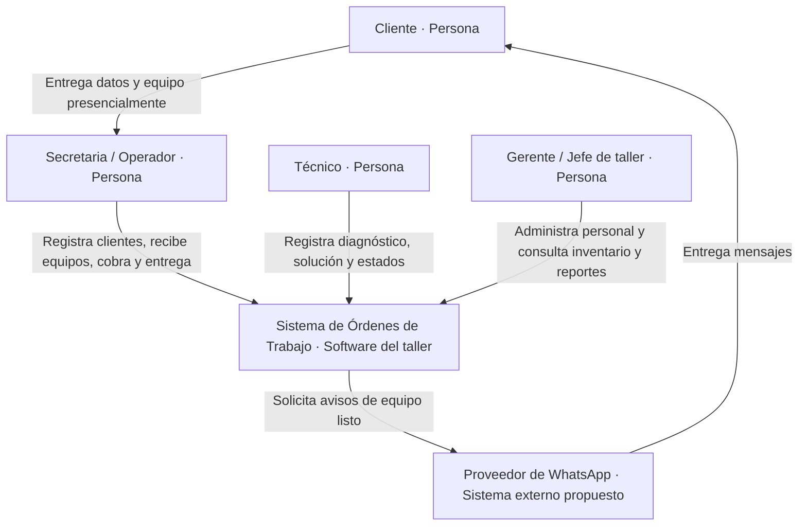

# C4 — Nivel 1: contexto del sistema

**Caso:** Órdenes de Trabajo — Taller y soporte técnico.

Esta vista representa el alcance del sistema del H1, no una afirmación de que todo esté programado. Los cuatro actores provienen del inventario original. WhatsApp es una integración propuesta, coherente con el laboratorio Adapter; allí la API también es simulada. El cliente se comunica con el taller y recibe avisos: no se supone un portal de autoservicio.

