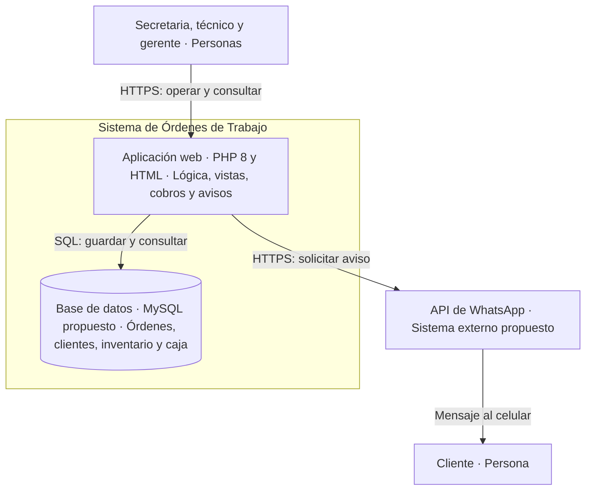

# C4 — Nivel 2: contenedores

## Arquitectura objetivo propuesta

Un contenedor C4 es una aplicación o almacén de datos; no es una clase PHP ni necesariamente un contenedor Docker. Propongo una aplicación web monolítica para el tamaño del taller. La interfaz HTML es servida por PHP, por lo que no se presenta como una SPA desplegada por separado. MySQL y la API real de WhatsApp quedan pendientes de implementación.

