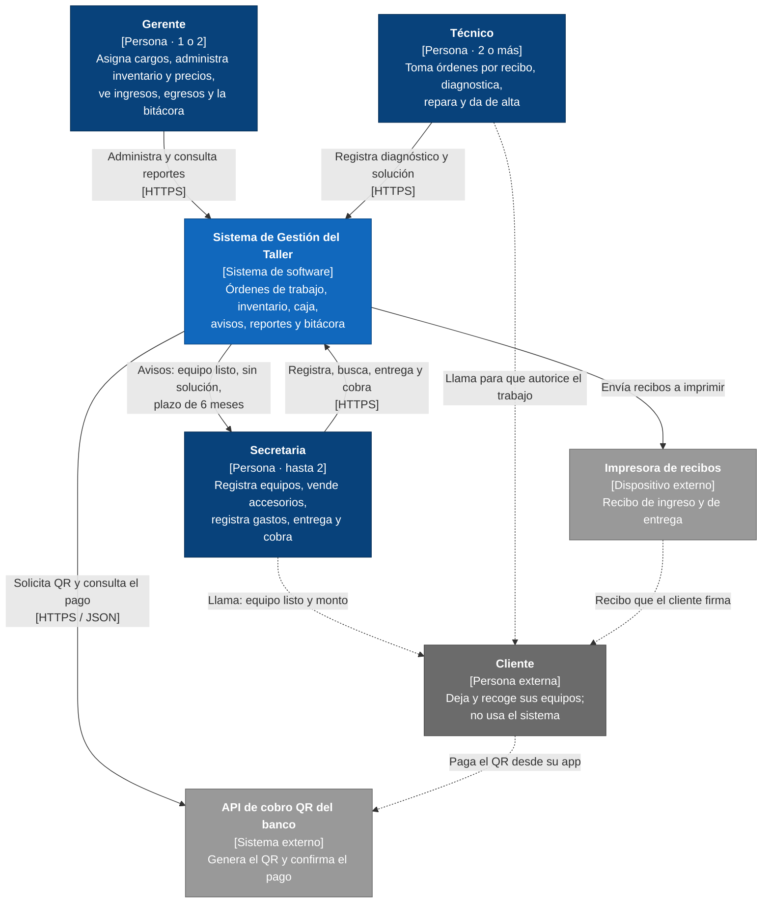
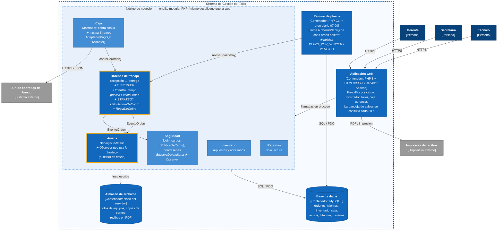

# H4 (parte B) — Documentación de la decisión: C4 + ADR

**Autor:** Richard Cuellar Rojas · **Variante 6:** Taller y soporte técnico

---

## C4 — Nivel 1: Contexto

Mi sistema como una sola caja, quién lo usa y con qué sistemas externos habla.

---

## C4 — Nivel 2: Contenedores

Qué se despliega y dónde viven los dos patrones de la fusión (marcados con ★).

### Dónde viven los dos patrones

| Patrón | Contenedor | Módulo | Clases |
|---|---|---|---|
| **Observer** — sujeto | Aplicación web (núcleo) y Revisor de plazos | Órdenes de trabajo | `OrdenDeTrabajo`, `EventoOrden` |
| **Observer** — observadores | Aplicación web (núcleo) | Avisos y Seguridad | `BandejaDeAvisos`, `BitacoraDeAuditoria` (persisten en MySQL) |
| **Strategy** | Aplicación web (núcleo) | Órdenes de trabajo | `CalculadoraDeCobro`, `ReglaDeCobro` y sus 3 reglas |
| **Fusión** | Aplicación web (núcleo) | Avisos + Caja | `BandejaDeAvisos` y `Mostrador` usan la **misma** `CalculadoraDeCobro` |

