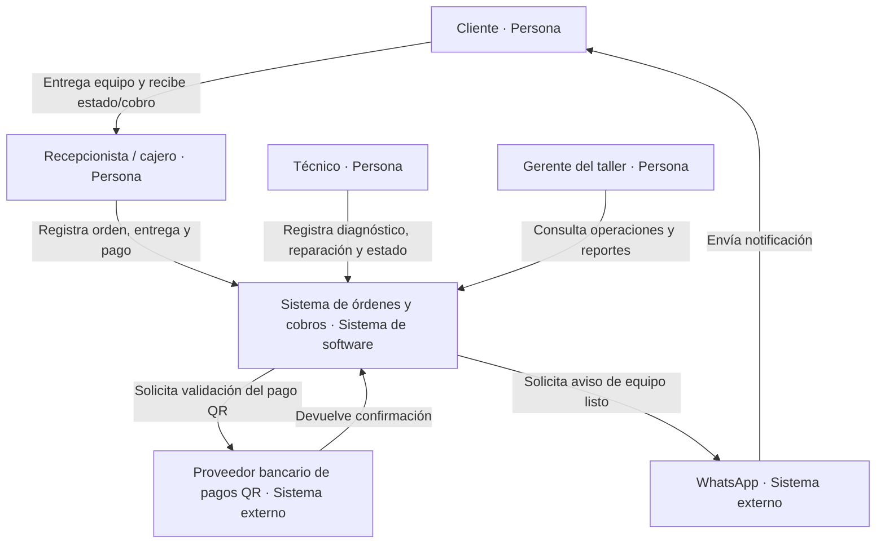
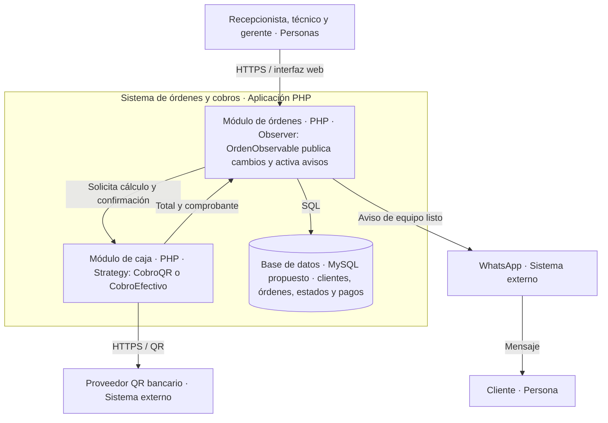

# H4 — decisión arquitectónica del sistema de órdenes y cobros

## C4 nivel 1 — contexto

El sistema registra la recepción, diagnóstico, reparación, entrega y cobro de equipos en un taller de soporte técnico. El pago puede realizarse por QR o en efectivo. El proveedor QR y el servicio de mensajería son sistemas externos; el efectivo se registra dentro de la caja del taller.

## C4 nivel 2 — contenedores lógicos

Para el tamaño del taller se propone un monolito PHP. Los contenedores siguientes son módulos lógicos de esa aplicación, no contenedores Docker. La ubicación de los patrones se marca dentro del módulo que los usa.

